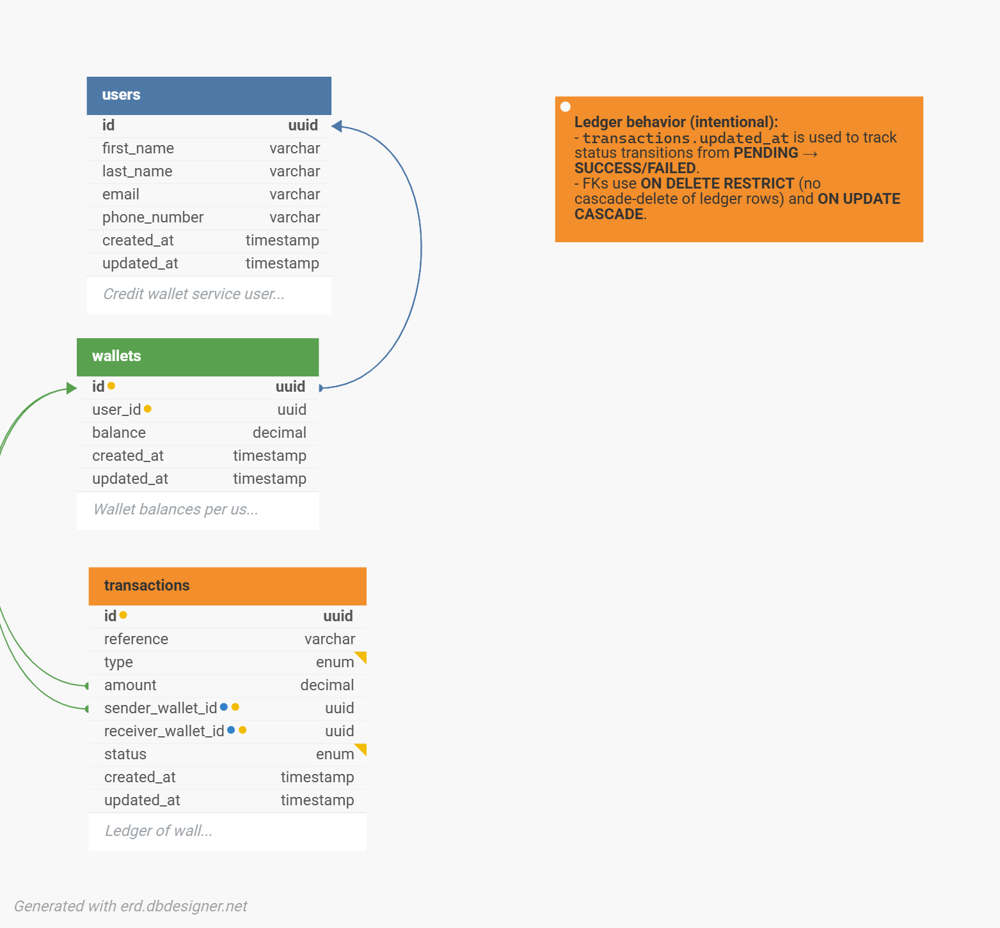

# Demo Credit — Wallet Service

A transactional wallet service API built as a backend engineering assessment for Lendsqr. Demo Credit provides the wallet infrastructure required by a mobile lending app — borrowers need wallets to receive disbursed loans and send repayments.

## Table of Contents

- [Tech Stack](#tech-stack)
- [Architecture](#architecture)
- [E-R Diagram](#e-r-diagram)
- [Database Design](#database-design)
- [API Reference](#api-reference)
- [Quick Start](#quick-start)
- [Running Migrations](#running-migrations)
- [Running Tests](#running-tests)
- [Design Decisions and Trade-offs](#design-decisions-and-trade-offs)
- [Known Limitations and Production Extensions](#known-limitations-and-production-extensions)

---

## Tech Stack

| Concern      | Technology                        |
| ------------ | --------------------------------- |
| Runtime      | Node.js v20 (LTS)                 |
| Language     | TypeScript (strict mode)          |
| Framework    | Express.js v5                     |
| ORM          | KnexJS v3                         |
| Database     | MySQL 8.0                         |
| Auth         | JWT (jsonwebtoken, HS256)         |
| Validation   | Zod                               |
| External API | Lendsqr Adjutor (Karma blacklist) |
| HTTP Client  | Axios                             |
| Testing      | Vitest + @vitest/coverage-v8      |

---

## Architecture

The application follows a strict three-layer architecture, implemented with class-based OOP throughout:

```sh
HTTP Request
    ↓
Controllers        — HTTP in/out only. Validates request shape via Zod.
                     Maps AppError instances to status codes. No business logic.
    ↓
Services           — Business logic. Owns all Knex transaction scoping.
                     Enforces financial invariants (balance checks, blacklist check,
                     self-transfer guard, amount precision).
    ↓
Repositories       — Knex queries only. No logic. All mutation methods
                     accept a Knex.Transaction argument — no balance
                     updates happen outside a transaction.
```

### Project Structure

```bash
demo-credit/
├── src/
│   ├── config/
│   │   ├── database.ts        # Knex singleton
│   │   └── env.ts             # Typed env with fail-fast validation
│   ├── controllers/
│   │   ├── user.controller.ts
│   │   └── wallet.controller.ts
│   ├── services/
│   │   ├── user.service.ts
│   │   ├── wallet.service.ts
│   │   └── karma.service.ts
│   ├── repositories/
│   │   ├── user.repository.ts
│   │   └── wallet.repository.ts
│   ├── middleware/
│   │   └── auth.middleware.ts
│   ├── routes/
│   │   ├── index.ts
│   │   ├── user.routes.ts
│   │   └── wallet.routes.ts
│   ├── types/
│   │   ├── index.ts           # Domain interfaces + DTOs + AppError class
│   │   └── express.d.ts       # Express Request augmentation (req.user)
│   ├── utils/
│   │   └── helpers.ts         # ID generation, reference generation, response helpers
│   └── app.ts
├── db/
│   └── migrations/
├── tests/
│   ├── user.test.ts
│   └── wallet.test.ts
├── .env.example
├── knexfile.ts
├── tsconfig.json
├── vitest.config.ts
└── package.json
```

---

## E-R Diagram

> Link to E-R diagram: **[dbdesigner.net diagram — Demo Credit Wallet Service](https://dbdesigner.page.link/nct7WquZHf6xkP9h6)**
>


The schema comprises three tables with the following relationships:

- `users` ← one-to-one → `wallets` (via `wallets.user_id`)
- `wallets` ← one-to-many → `transactions` (via `sender_wallet_id` and `receiver_wallet_id`)

---

## Database Design

### Schema

```sql
-- Users
CREATE TABLE users (
  id            char(36)      NOT NULL PRIMARY KEY,
  first_name    varchar(255)  NOT NULL,
  last_name     varchar(255)  NOT NULL,
  email         varchar(255)  NOT NULL UNIQUE,
  phone_number  varchar(255)  NOT NULL UNIQUE,
  created_at    timestamp     NOT NULL DEFAULT CURRENT_TIMESTAMP,
  updated_at    timestamp     NOT NULL DEFAULT CURRENT_TIMESTAMP
                              ON UPDATE CURRENT_TIMESTAMP
);

-- Wallets (one per user)
CREATE TABLE wallets (
  id          char(36)       NOT NULL PRIMARY KEY,
  user_id     char(36)       NOT NULL UNIQUE,
  balance     decimal(20,2)  NOT NULL DEFAULT 0.00,
  created_at  timestamp      NOT NULL DEFAULT CURRENT_TIMESTAMP,
  updated_at  timestamp      NOT NULL DEFAULT CURRENT_TIMESTAMP
                             ON UPDATE CURRENT_TIMESTAMP,
  FOREIGN KEY (user_id) REFERENCES users(id)
    ON DELETE RESTRICT ON UPDATE CASCADE
);

-- Transactions (financial ledger)
CREATE TABLE transactions (
  id                  char(36)      NOT NULL PRIMARY KEY,
  reference           varchar(255)  NOT NULL UNIQUE,
  type                ENUM('FUND', 'TRANSFER', 'WITHDRAWAL') NOT NULL,
  amount              decimal(20,2) NOT NULL,
  sender_wallet_id    char(36)      DEFAULT NULL,
  receiver_wallet_id  char(36)      DEFAULT NULL,
  status              ENUM('PENDING', 'SUCCESS', 'FAILED') NOT NULL,
  created_at          timestamp     NOT NULL DEFAULT CURRENT_TIMESTAMP,
  updated_at          timestamp     NOT NULL DEFAULT CURRENT_TIMESTAMP
                                    ON UPDATE CURRENT_TIMESTAMP,
  CONSTRAINT transactions_chk_1 CHECK (amount > 0),
  FOREIGN KEY (sender_wallet_id) REFERENCES wallets(id)
    ON DELETE RESTRICT ON UPDATE CASCADE,
  FOREIGN KEY (receiver_wallet_id) REFERENCES wallets(id)
    ON DELETE RESTRICT ON UPDATE CASCADE
);

CREATE INDEX idx_transactions_sender   ON transactions (sender_wallet_id);
CREATE INDEX idx_transactions_receiver ON transactions (receiver_wallet_id);
```

### Design Rationale

**`DECIMAL(20,2)` for all money columns.** Floating-point types (`FLOAT`, `DOUBLE`) are unsuitable for financial values due to IEEE 754 rounding errors. `DECIMAL(20,2)` stores exact cent-precision values.

**Separate `wallets` table.** A user _has_ a wallet — they are distinct entities. The one-to-one relationship is enforced with a `UNIQUE` constraint on `wallets.user_id`. This keeps the data model clean and makes it straightforward to extend to multiple wallets per user in future.

**Nullable `sender_wallet_id` and `receiver_wallet_id`.** Transaction types are asymmetric: `FUND` has no sender, `WITHDRAWAL` has no receiver, `TRANSFER` has both. Nullable FKs reflect this accurately rather than using a sentinel wallet or conflating unrelated concepts.

**`UNIQUE` reference on transactions.** Every transaction is assigned a unique `DC-{timestamp}-{random}` reference on creation. The DB-level unique constraint is the idempotency guard — duplicate inserts with the same reference are rejected by the database regardless of application state.

**`ON DELETE RESTRICT` on all FKs.** A user or wallet cannot be deleted if transactions reference them. In a fintech system, financial records must be preserved regardless of account lifecycle state. This is a non-negotiable data integrity constraint.

**BTREE indexes on `sender_wallet_id` and `receiver_wallet_id`.** While foreign key constraints require indexed columns, relying on implicit behavior is not ideal for query planning clarity and maintainability. Explicit indexes were created intentionally for predictable performance. MySQL InnoDB does not auto-index FK columns (only the referenced PK). Without explicit indexes, transaction history queries become full table scans as the ledger grows. With BTREE indexes, lookup by wallet ID is O(log n).

**`updated_at` on `transactions`.** A financial ledger is logically append-only, but the `status` column transitions from `PENDING` to `SUCCESS` (or `FAILED`). The `updated_at` field tracks when that state transition occurred — a timestamped audit trail of finality rather than an arbitrary mutation log.

---

## API Reference

All wallet endpoints require a `Bearer` token in the `Authorization` header.
Base path: `/api/v1`

### Health Check

```sh
GET /health
```

Response:

```json
{ "status": "ok", "database": "connected" }
```

---

### Users

#### Register a user

**Terminal Example:**

```sh
~/sandbox/demo-credit on  feat/user-module !+?  via  v20.20.0 is 󰏗 v1.0.0 3s
❯ curl -s -X POST http://localhost:3000/api/v1/users   -H "Content-Type: application/json"   -d '{
    "first_name": "Ayomide",
    "last_name": "Kayode",
    "email": "ayomide.smoketest.01@gmail.com",
    "phone_number": "08012345678"
  }' | jq
{
  "status": "success",
  "message": "Account created successfully",
  "data": {
    "user": {
      "id": "59a5d16c-311e-4497-a180-d0d0995ebb07",
      "first_name": "Ayomide",
      "last_name": "Kayode",
      "email": "ayomide.smoketest.01@gmail.com",
      "phone_number": "08012345678",
      "created_at": "2026-05-09T11:40:17.938Z",
      "updated_at": "2026-05-09T11:40:17.938Z"
    },
    "token": "<REDACTED_JWT>"
  }
}
```

```sh
POST /api/v1/users
Content-Type: application/json
```

Request body:

```json
{
  "first_name": "Ayomide",
  "last_name": "Kayode",
  "email": "ayomide@example.com",
  "phone_number": "08012345678"
}
```

Success `201`:

```json
{
  "status": "success",
  "message": "Account created successfully",
  "data": {
    "user": {
      "id": "59a5d16c-311e-4497-a180-d0d0995ebb07",
      "first_name": "Ayomide",
      "last_name": "Kayode",
      "email": "ayomide@example.com",
      "phone_number": "08012345678",
      "created_at": "2026-05-09T11:40:17.938Z",
      "updated_at": "2026-05-09T11:40:17.938Z"
    },
    "token": "<JWT>"
  }
}
```

Error cases:

- `400` — invalid request body (missing field, bad email format)
- `403` — email found in Lendsqr Adjutor Karma blacklist
- `409` — email or phone number already registered

#### Get user profile

```sh
GET /api/v1/users/:id
Authorization: Bearer <token>
```

**Example:**

```sh
~/sandbox/demo-credit on  feat/readme-and-docs !?  via  v20.20.0 is 󰏗 v1.0.0
❯ curl -s http://localhost:3000/api/v1/users/59a5d16c-311e-4497-a180-d0d0995ebb07 \
  -H "Authorization: Bearer $TOKEN" | jq
{
  "status": "success",
  "message": "User retrieved successfully",
  "data": {
    "id": "59a5d16c-311e-4497-a180-d0d0995ebb07",
    "first_name": "Ayomide",
    "last_name": "Kayode",
    "email": "ayomide.smoketest.01@gmail.com",
    "phone_number": "08012345678",
    "created_at": "2026-05-09T11:40:18.000Z",
    "updated_at": "2026-05-09T11:40:18.000Z"
  }
}
```

Returns the authenticated user's own profile. A user cannot fetch another user's profile — mismatched token and path ID returns `403`.

---

### Wallets

**Terminal Example:**

```sh
~/sandbox/demo-credit on  feat/wallet-module !?  via  v20.20.0 is 󰏗 v1.0.0 5s
❯ TOKEN="eyJhbGci...<REDACTED_JWT_FROM_INITIALLY_CREATED_USER>"

# Get wallet
~/sandbox/demo-credit on  feat/wallet-module !?  via  v20.20.0 is 󰏗 v1.0.0
❯ curl -s http://localhost:3000/api/v1/wallets/me \
  -H "Authorization: Bearer $TOKEN" | jq
{
  "status": "success",
  "message": "Wallet retrieved successfully",
  "data": {
    "id": "3b4d5d5b-fb99-4e27-a40a-46cf3e9ca97e",
    "user_id": "59a5d16c-311e-4497-a180-d0d0995ebb07",
    "balance": 0,
    "created_at": "2026-05-09T11:40:18.000Z",
    "updated_at": "2026-05-09T11:40:18.000Z"
  }
}

# Fund
~/sandbox/demo-credit on  feat/wallet-module !?  via  v20.20.0 is 󰏗 v1.0.0
❯ curl -s -X POST http://localhost:3000/api/v1/wallets/fund \
  -H "Authorization: Bearer $TOKEN" \
  -H "Content-Type: application/json" \
  -d '{"amount": 5000}' | jq
{
  "status": "success",
  "message": "Wallet funded successfully",
  "data": {
    "id": "3b4d5d5b-fb99-4e27-a40a-46cf3e9ca97e",
    "user_id": "59a5d16c-311e-4497-a180-d0d0995ebb07",
    "balance": 5000,
    "created_at": "2026-05-09T11:40:18.000Z",
    "updated_at": "2026-05-09T11:40:18.000Z"
  }
}

# Withdraw
~/sandbox/demo-credit on  feat/wallet-module !?  via  v20.20.0 is 󰏗 v1.0.0
❯ curl -s -X POST http://localhost:3000/api/v1/wallets/withdraw \
  -H "Authorization: Bearer $TOKEN" \
  -H "Content-Type: application/json" \
  -d '{"amount": 1000}' | jq
{
  "status": "success",
  "message": "Withdrawal successful",
  "data": {
    "id": "3b4d5d5b-fb99-4e27-a40a-46cf3e9ca97e",
    "user_id": "59a5d16c-311e-4497-a180-d0d0995ebb07",
    "balance": 4000,
    "created_at": "2026-05-09T11:40:18.000Z",
    "updated_at": "2026-05-09T18:02:21.000Z"
  }
}
```

#### Get wallet

```sh
GET /api/v1/wallets/me
Authorization: Bearer <token>
```

Success `200`:

```json
{
  "status": "success",
  "message": "Wallet retrieved successfully",
  "data": {
    "id": "3b4d5d5b-fb99-4e27-a40a-46cf3e9ca97e",
    "user_id": "59a5d16c-311e-4497-a180-d0d0995ebb07",
    "balance": 0,
    "created_at": "2026-05-09T11:40:18.000Z",
    "updated_at": "2026-05-09T11:40:18.000Z"
  }
}
```

#### Fund wallet

```sh
POST /api/v1/wallets/fund
Authorization: Bearer <token>
Content-Type: application/json
```

Request body:

```json
{ "amount": 5000 }
```

Success `200` — returns updated wallet with new balance.

Error cases:

- `400` — amount is zero, negative, or has more than 2 decimal places

#### Transfer funds

Another `user_id` must exist to use the transfer logic. Create another user if you have only one user in the db.

**Example:**

```sh
# Create new user
~/sandbox/demo-credit on  feat/wallet-module !?  via  v20.20.0 is 󰏗 v1.0.0
❯ curl -s -X POST http://localhost:3000/api/v1/users   -H "Content-Type: application/json"   -d '{
    "first_name": "Eseose",
    "last_name": "Lendsqr",
    "email": "eseose.smoketest.02@gmail.com",
    "phone_number": "09012345678"
  }' | jq
{
  "status": "success",
  "message": "Account created successfully",
  "data": {
    "user": {
      "id": "b64e3d89-383a-43eb-a402-c089e1cb5568",
      "first_name": "Eseose",
      "last_name": "Lendsqr",
      "email": "eseose.smoketest.02@gmail.com",
      "phone_number": "09012345678",
      "created_at": "2026-05-09T18:18:32.753Z",
      "updated_at": "2026-05-09T18:18:32.753Z"
    },
    "token": "eyJhbGci...<REDACTED_JWT>"
  }
}

# Transfer funds from Ayomide to Eseose
~/sandbox/demo-credit on  feat/wallet-module !?  via  v20.20.0 is 󰏗 v1.0.0
❯ curl -s -X POST http://localhost:3000/api/v1/wallets/transfer \
  -H "Authorization: Bearer $TOKEN" \
  -H "Content-Type: application/json" \
  -d '{
    "receiver_id": "b64e3d89-383a-43eb-a402-c089e1cb5568",
    "amount": 1500
  }' | jq
{
  "status": "success",
  "message": "Transfer successful",
  "data": {
    "id": "3b4d5d5b-fb99-4e27-a40a-46cf3e9ca97e",
    "user_id": "59a5d16c-311e-4497-a180-d0d0995ebb07",
    "balance": 2500,
    "created_at": "2026-05-09T11:40:18.000Z",
    "updated_at": "2026-05-09T18:02:46.000Z"
  }
}

```

- Verify funds was received by Eseose (Second User)

```sh
# Change Token
~/sandbox/demo-credit on  feat/wallet-module !?  via  v20.20.0 is 󰏗 v1.0.0
❯ TOKEN="eyJhbGci...<REDACTED_JWT_FOR_SECOND_USER>"

# Get Wallet
~/sandbox/demo-credit on  feat/wallet-module !?  via  v20.20.0 is 󰏗 v1.0.0
❯ curl -s http://localhost:3000/api/v1/wallets/me   -H "Authorization: Bearer $TOKEN" | jq
{
  "status": "success",
  "message": "Wallet retrieved successfully",
  "data": {
    "id": "da3ee036-32b7-417f-a4b1-1df0b32cb628",
    "user_id": "b64e3d89-383a-43eb-a402-c089e1cb5568",
    "balance": 1500,
    "created_at": "2026-05-09T18:18:33.000Z",
    "updated_at": "2026-05-09T18:46:01.000Z"
  }
}
```

```sh
POST /api/v1/wallets/transfer
Authorization: Bearer <token>
Content-Type: application/json
```

Request body:

```json
{
  "receiver_id": "b64e3d89-383a-43eb-a402-c089e1cb5568",
  "amount": 1500
}
```

Success `200` — returns sender's updated wallet.

Error cases:

- `400` — invalid amount, self-transfer, insufficient balance
- `404` — receiver user not found

#### Withdraw funds

```sh
POST /api/v1/wallets/withdraw
Authorization: Bearer <token>
Content-Type: application/json
```

Request body:

```json
{ "amount": 1000 }
```

Success `200` — returns updated wallet with reduced balance.

Error cases:

- `400` — invalid amount or insufficient balance

**Example:**

```sh
~/sandbox/demo-credit on  feat/readme-and-docs !?  via  v20.20.0 is 󰏗 v1.0.0
❯ curl -s -X POST http://localhost:3000/api/v1/wallets/withdraw \
  -H "Authorization: Bearer $TOKEN" \
  -H "Content-Type: application/json" \
  -d '{"amount": 10000}' | jq
{
  "status": "error",
  "message": "Insufficient balance"
}
```

---

## Quick Start

1. [Clone repo](#installation)
2. [Install dependencies](#installation)
3. [Create `.env`](#environment-variables)
4. [Create MySQL database](#create-the-database)
5. [Run migrations](#running-migrations)
6. [Start dev server](#start-the-server)
7. [Run tests](#running-tests)

### Prerequisites

- Recommended: Node.js v20+ LTS (via nvm)
- MySQL 8.0

### Installation

```bash
git clone <repo-url>
cd demo-credit
npm install
```

### Environment Variables

```bash
cp .env.example .env
```

Edit `.env` with your values:

```env
NODE_ENV=development
PORT=3000

DB_HOST=localhost
DB_PORT=3306
DB_USER=root
DB_PASSWORD=your_password
DB_NAME=demo_credit

JWT_SECRET=your_jwt_secret
ADJUTOR_API_KEY=your_adjutor_api_key

# Set to true to bypass Karma check in development only.
# Never active when NODE_ENV=production.
SKIP_KARMA_CHECK=false
```

### Create the database

```bash
mysql -u root -p -e "CREATE DATABASE demo_credit;"
```

### Start the server

```bash
npm run dev
```

---

## Running Migrations

```bash
npm run migrate
```

Verify tables:

```bash
mysql -u root -p demo_credit -e "SHOW TABLES;"
```

```mysql
+-----------------------+
| Tables_in_demo_credit |
+-----------------------+
| knex_migrations       |
| knex_migrations_lock  |
| transactions          |
| users                 |
| wallets               |
+-----------------------+
```

To roll back:

```bash
npm run migrate:rollback
```

---

## Running Tests

```bash
npm test
```

```sh
~/sandbox/demo-credit on  feat/tests !?  via  v20.20.0 is 󰏗 v1.0.0
❯ npm test

> demo-credit@1.0.0 test
> vitest run


 RUN  v4.1.5 /home/ayomide/sandbox/demo-credit

 ✓ tests/wallet.test.ts (20 tests) 77ms
 ✓ tests/user.test.ts (8 tests) 37ms

 Test Files  2 passed (2)
      Tests  28 passed (28)
   Start at  06:08:06
   Duration  2.04s (transform 1.04s, setup 0ms, import 2.50s, tests 115ms, environment 1ms)


~/sandbox/demo-credit on  feat/tests !?  via  v20.20.0 is 󰏗 v1.0.0 4s
❯
```

### Test coverage

Tests operate at the service layer with all repositories, the Karma service, and the database fully mocked. No DB or network calls are made during test runs.

Tests intentionally run as pure unit tests rather than integration tests to guarantee determinism, speed, and isolation of business rules.

**User tests (8):** registration happy path, Karma blacklist rejection (403), duplicate email fast-path (409), DB-level `ER_DUP_ENTRY` handling for phone number uniqueness and race conditions (409), Karma service 503 propagation, `findById` success and 404.

**Wallet tests (20):** `getWallet` success and 404; `fund` balance increase, PENDING→SUCCESS transaction lifecycle, zero/negative/sub-cent amount rejection, wallet not found; `withdraw` balance decrease, transaction record creation, insufficient funds rejection, invalid amount rejection; `transfer` happy path (sender debit, receiver credit, transaction record), self-transfer rejection, insufficient balance rejection, receiver-not-found (404), sub-cent precision rejection.

**Not yet covered (documented for completeness):**

- Auth middleware unit tests — missing/invalid/malformed token paths
- Controller-layer tests — Zod validation, ownership check on `GET /users/:id`
- Integration tests — HTTP-level request/response with supertest

These are the natural next layer and would be added before a production release.

---

## Design Decisions and Trade-offs

### Transaction scoping

Every money-moving operation (`fund`, `transfer`, `withdraw`) runs inside a Knex transaction. Balance checks, transaction record creation, balance updates, and status transitions all happen atomically — the database either applies all changes or none. There is no window where a partial state is visible.

### Row-level locking in transfers

Before modifying any wallet balance, the service acquires a `SELECT ... FOR UPDATE` lock on the wallet row via Knex's `.forUpdate()`. For transfers involving two wallets, locks are always acquired in ascending wallet ID order regardless of which wallet is sender and which is receiver. This prevents deadlocks when two concurrent transfers involve the same two wallets in opposite directions — both transactions acquire locks in the same order, so neither can deadlock waiting on the other.

### PENDING → SUCCESS transaction lifecycle

Transaction records are inserted with `status: 'PENDING'` before any balance mutation occurs. After the balance update succeeds, the status is updated to `SUCCESS` within the same Knex transaction. This pattern reflects production state machine awareness — a failed balance update would leave the transaction in `PENDING` or allow rollback to `FAILED` without corrupting the ledger.

### Amount precision enforcement

The service layer rejects any amount where `Math.round(amount * 100) / 100 !== amount` — i.e. any value that cannot be represented exactly as a two-decimal-place number. This ensures that values the database cannot store as `DECIMAL(20,2)` never enter balance arithmetic. The DB-level `CHECK (amount > 0)` constraint is the final guard.

### Balance arithmetic precision

`mysql2` returns `DECIMAL` columns as strings over the wire. The repository layer parses these with `parseFloat(...).toFixed(2)` on read and rounds to `toFixed(2)` on write. For a production system handling large volumes, the correct approach is a dedicated decimal library (`decimal.js`). This is documented as a known extension point.

### Karma check fail-closed

If the Adjutor API is unreachable or returns an unexpected error during registration, the request is rejected with `503`. Users are never silently allowed through when eligibility cannot be confirmed. A 5-second timeout prevents a slow upstream from stalling the registration flow indefinitely.

### Karma check in development

During development, the Adjutor test mode toggle in the dashboard could not be set to live mode — the toggle reverted to test mode immediately after switching. In test mode, the Adjutor API returns `200` with an empty body `{}` for every identity, making it impossible to simulate a clean user registration. An escalation email was sent to `careers@lendsqr.com` and `support@lendsqr.com` and is awaiting response.

To unblock development, an environment flag `SKIP_KARMA_CHECK=true` bypasses the Karma check when `NODE_ENV=development`. This bypass is never active when `NODE_ENV=production` — the check is conditional on both flags simultaneously. The Karma integration code itself is complete and correct; the bypass is a development workflow accommodation, not a production shortcut.

### Authentication

The assessment specifies "a faux token based authentication will suffice." JWT tokens (HS256, 24-hour expiry) are issued on registration and verified by middleware on all protected routes. The JWT payload is validated at runtime — the middleware does not blindly cast the decoded payload but checks that it is a non-null object containing a string `id` property before attaching `req.user`.

### No `@/` path aliases

Path aliases were removed from `tsconfig.json`. Aliases only affect the TypeScript type checker — `ts-node` and the Node.js runtime do not resolve them without `tsconfig-paths`, which adds setup complexity for no meaningful gain at this folder depth.

### `knexfile.ts` is self-contained

`knexfile.ts` reads `process.env` directly rather than importing from `src/config/env.ts`. The Knex CLI is a separate consumer from the application — sharing config via a cross-boundary import caused a TypeScript `rootDir` violation. Both consumers read the same env variables; the duplication is structurally correct.

---

## Known Limitations and Production Extensions

| Area               | Current state                                            | Production approach                                               |
| ------------------ | -------------------------------------------------------- | ----------------------------------------------------------------- |
| Decimal arithmetic | `parseFloat` + `toFixed(2)` rounding at DB boundary      | `decimal.js` or `big.js` throughout the service layer             |
| Idempotency        | Server-generated `reference` with DB `UNIQUE` constraint | Caller-supplied idempotency key with dedicated tracking table     |
| Auth               | Faux JWT, shared secret                                  | Asymmetric keys (RS256), refresh tokens, token revocation         |
| Karma in dev       | Bypassed via `SKIP_KARMA_CHECK`                          | Adjutor live mode (pending support response)                      |
| Test coverage      | Service layer only                                       | Add middleware unit tests + HTTP integration tests with supertest |
| Wallet limits      | None                                                     | Per-wallet daily limits, transaction velocity checks              |
| Soft deletes       | Hard constraint via `ON DELETE RESTRICT`                 | Soft delete with `deleted_at`, account deactivation flow          |
